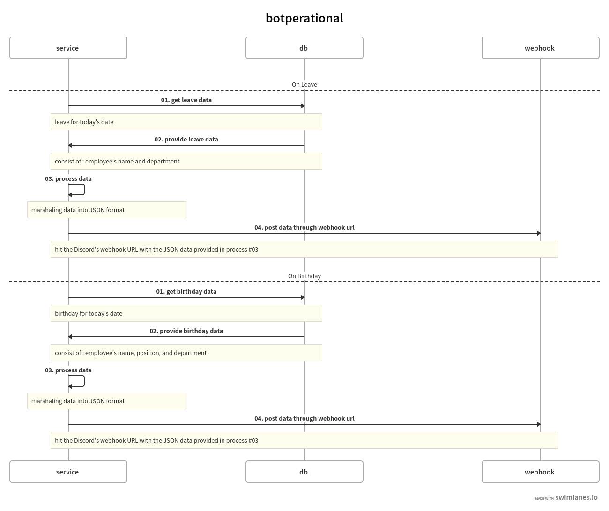

# botperational

`botperational` is a service to sent an information through Discord.
For now, it provide who is on leave and on birthday today.

## Flow


It has a simple flow between the service, the database storage, and Discord as the consumer.
For short, once the service has acquire the needed data, it would sent the data to Discord via webhook URL.

### Story
Starting with repeated questions like "is he/she is taking a leave?" or "is there any employee that taking a leave today?"
And also the accidentally-forgoten birthday information that usually done by the HR team manually, may lead the employee feels abandoned.

Based on those stories, I came up with a simple idea that "why not blasting the leave and birthday information on Discord since we're actually using it as our main communication platform?"
Then, here we are, `botperational` is born!

For now, it only provide the leave and birthday data. But, not to mention there are lots of operational information (and action!) that would be implemented in the near future!
So, stay tuned for the updates!

## Project status

It is an ongoing project, with the current maintainer is carakawedhatama@gmail.com

## Prerequisites
Before using this project, make sure you have the following applications or libraries installed:

- Go 1.21 or higher. You could download it [here](https://go.dev/dl/).
- [cosmtrek/air](https://github.com/cosmtrek/air) (to run watch mode)
- MariaDB 10.3 or higher. You could download it [here](https://mariadb.org/download/).

## Usage
To use `botperational`, follow these steps: 
1. Clone this project's `main` branch
```bash
git clone -b main [git_url]
```

2. Copy the config file, and adjust as it fits your needs
```bash
cp config.sample.yml config.yml
cp .env.sample .env
```
You could ask the maintainer about the sample config files.

3. Download the dependency library
```bash
go mod tidy
```

## License
This project is under [MIT License](http://botperational/-/blob/main/LICENSE).